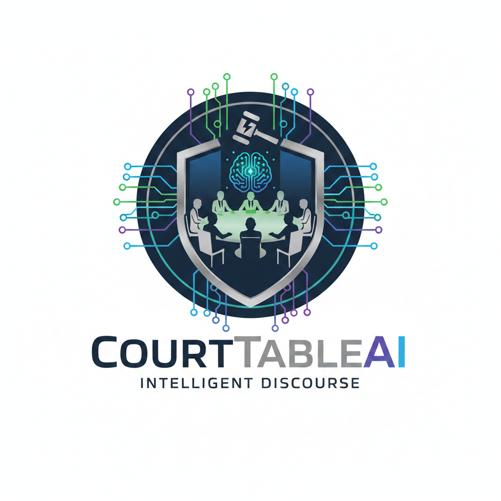

# Court Table AI - Multi-Agent Debate System

<p align="center">
  
</p>

A web-based application for managing AI agents and facilitating automatic debates/discussions between agents using a "Round Robin with Timeout" schema to generate the best answers for users.

## Features

- **Multi-Agent Management**: Configure and manage AI agents with different providers (Ollama, OpenAI, Anthropic, Google Gemini)
- **Debate Engine**: Orchestrates discussions between multiple AI agents in a round-robin format
- **Moderator Support**: Optional AI moderator to guide discussions, provide opening/closing remarks, and maintain discourse quality
- **Multi-Provider Support**: Native support for OpenAI, Anthropic Claude, Google Gemini, Ollama, and custom OpenAI-compatible APIs
- **Real-time Updates**: Server-Sent Events (SSE) for live debate updates
- **Web Dashboard**: Clean, responsive UI built with HTML, HTMX, and Tailwind CSS
- **History Tracking**: Complete discussion history with agent responses and timestamps
- **Agent Health Checks**: Ping agents to verify connectivity

## Technology Stack

- **Backend**: Go (Golang) with Echo framework
- **Frontend**: HTML5/HTMX, Tailwind CSS, Vanilla JavaScript
- **Database**: SQLite for lightweight, local data storage
- **AI Integration**: REST API supporting OpenAI format and Ollama API

## Quick Start

### Prerequisites

- Go 1.24+ installed
- An AI provider (Ollama, OpenAI, or OpenAI-compatible API)

### Installation

1. Clone the repository:
```bash
git clone <repository-url>
cd CourtTableAI
```

2. Install dependencies:
```bash
go mod tidy
```

3. Build and run:
```bash
go build cmd/main.go cmd/renderer.go
./main.exe  # on Windows
# or
./main     # on Unix systems
```

4. Open your browser and navigate to `http://localhost:8880`

## Usage

### 1. Add AI Agents

1. Go to the **Agents** page
2. Click **Add New Agent**
3. Fill in the agent details:
   - **Name**: Display name for the agent
   - **Provider URL**: API endpoint (e.g., `http://localhost:11434` for Ollama)
   - **API Token**: Authentication token (if required)
   - **Model Name**: Model to use (e.g., `llama2`, `gpt-3.5-turbo`)
   - **Timeout**: Response timeout in seconds

4. Test the connection with **Test Connection**

### 2. Start a Discussion

1. Go to the **Discussions** page
2. Click **Start New Discussion**
3. Enter the discussion topic
4. Select the agents to participate
5. Optionally select a **Moderator** to guide the discussion
6. Click **Start Discussion**

The debate engine will:
- Send the topic to the first agent
- If a moderator is selected, they will provide opening remarks
- Pass responses from one agent to the next as context
- Moderator provides interim commentary between agent responses
- Moderator summarizes each round and provides closing remarks
- Handle timeouts and errors gracefully
- Generate a final summary

### 3. Monitor Discussions

- View real-time updates on the discussion detail page
- See agent responses, timestamps, and response times
- Retry failed agent responses
- Stop running discussions
- View discussion history

## API Endpoints

### Agents
- `GET /api/agents` - List all agents
- `POST /api/agents` - Create new agent
- `GET /api/agents/:id` - Get agent details
- `PUT /api/agents/:id` - Update agent
- `DELETE /api/agents/:id` - Delete agent
- `POST /api/agents/:id/ping` - Test agent connectivity

### Discussions
- `GET /api/discussions` - List all discussions
- `POST /api/discussions` - Create new discussion
- `GET /api/discussions/:id` - Get discussion details with logs
- `POST /api/discussions/:id/stop` - Stop running discussion
- `POST /api/discussions/:id/retry/:agentId` - Retry failed agent response

### Real-time Updates
- `GET /api/discussions/:id/stream` - Server-Sent Events stream

## Database Schema

### Agents Table
```sql
CREATE TABLE agents (
    id INTEGER PRIMARY KEY AUTOINCREMENT,
    name TEXT NOT NULL UNIQUE,
    provider_url TEXT NOT NULL,
    api_token TEXT NOT NULL,
    model_name TEXT NOT NULL,
    timeout_seconds INTEGER DEFAULT 30,
    created_at DATETIME DEFAULT CURRENT_TIMESTAMP,
    updated_at DATETIME DEFAULT CURRENT_TIMESTAMP
);
```

### Discussions Table
```sql
CREATE TABLE discussions (
    id INTEGER PRIMARY KEY AUTOINCREMENT,
    topic TEXT NOT NULL,
    final_summary TEXT,
    status TEXT DEFAULT 'running',
    agent_ids TEXT NOT NULL,
    created_at DATETIME DEFAULT CURRENT_TIMESTAMP,
    updated_at DATETIME DEFAULT CURRENT_TIMESTAMP
);
```

### Discussion Logs Table
```sql
CREATE TABLE discussion_logs (
    id INTEGER PRIMARY KEY AUTOINCREMENT,
    discussion_id INTEGER NOT NULL,
    agent_id INTEGER NOT NULL,
    content TEXT,
    status TEXT NOT NULL,
    response_time INTEGER DEFAULT 0,
    created_at DATETIME DEFAULT CURRENT_TIMESTAMP,
    FOREIGN KEY (discussion_id) REFERENCES discussions(id) ON DELETE CASCADE,
    FOREIGN KEY (agent_id) REFERENCES agents(id) ON DELETE CASCADE
);
```

## Supported AI Providers

### Ollama
- **Provider URL**: `http://localhost:11434`
- **Model Name**: Any model available in Ollama (e.g., `llama2`, `mistral`)

### OpenAI Compatible APIs
- **Provider URL**: API endpoint (e.g., `https://api.openai.com/v1`)
- **API Token**: Your API key
- **Model Name**: `gpt-3.5-turbo`, `gpt-4`, etc.

## Configuration

The application uses a SQLite database file (`court_table_ai.db`) that will be created automatically on first run.

## Development

### Project Structure

```
CourtTableAI/
├── cmd/
│   ├── main.go          # Application entry point
│   └── renderer.go      # Template renderer
├── pkg/
│   ├── database/        # Database operations
│   ├── handlers/        # HTTP handlers
│   ├── models/          # Data models
│   └── orchestrator/    # Debate engine and agent client
├── static/              # Static files (CSS, JS)
├── templates/           # HTML templates
├── go.mod              # Go module file
└── go.sum              # Go dependencies
```

### Running in Development Mode

```bash
go run cmd/main.go cmd/renderer.go
```

## License

This project is open source and available under the [MIT License](LICENSE).

## Contributing

1. Fork the repository
2. Create a feature branch
3. Make your changes
4. Add tests if applicable
5. Submit a pull request

## Support

For issues and questions:
1. Check the existing issues
2. Create a new issue with detailed information
3. Include logs and configuration details
